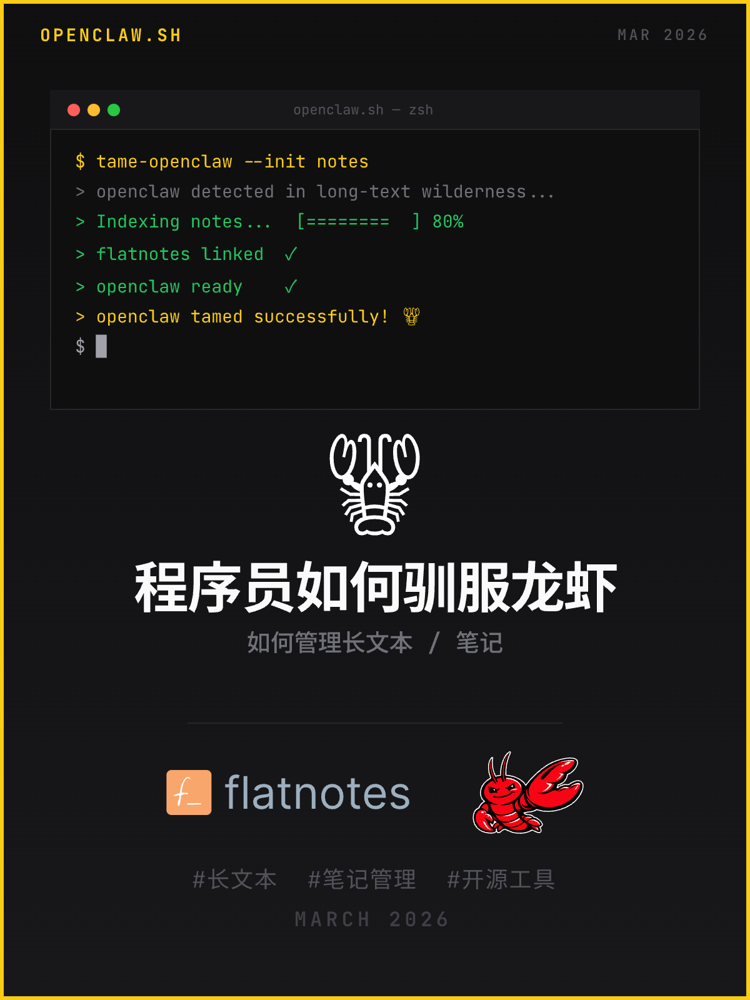
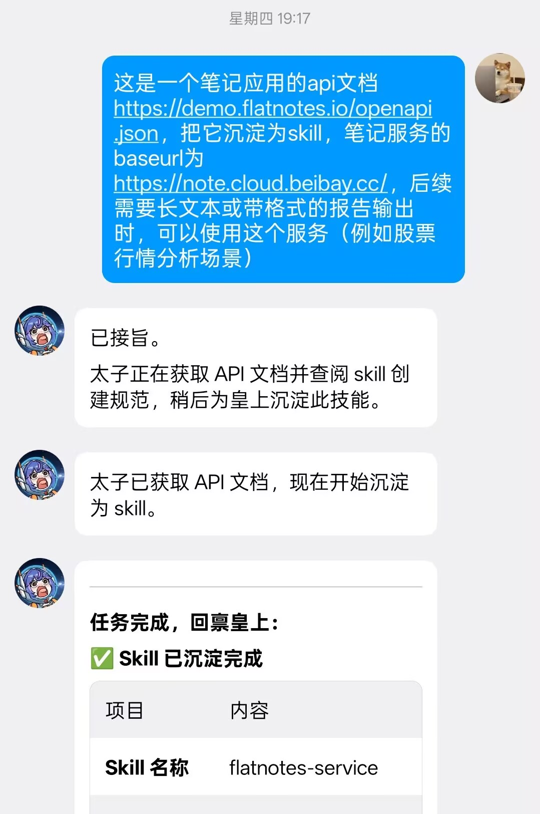
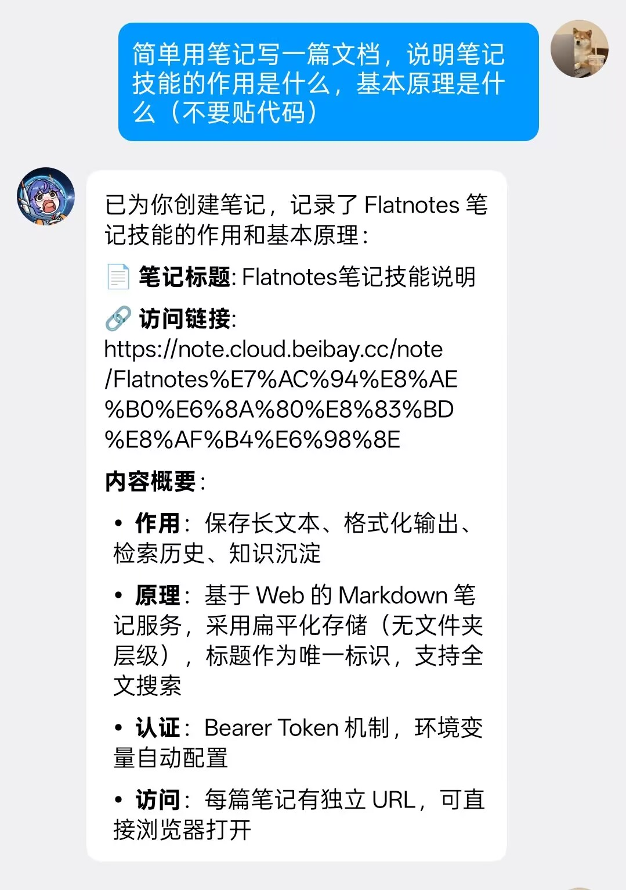
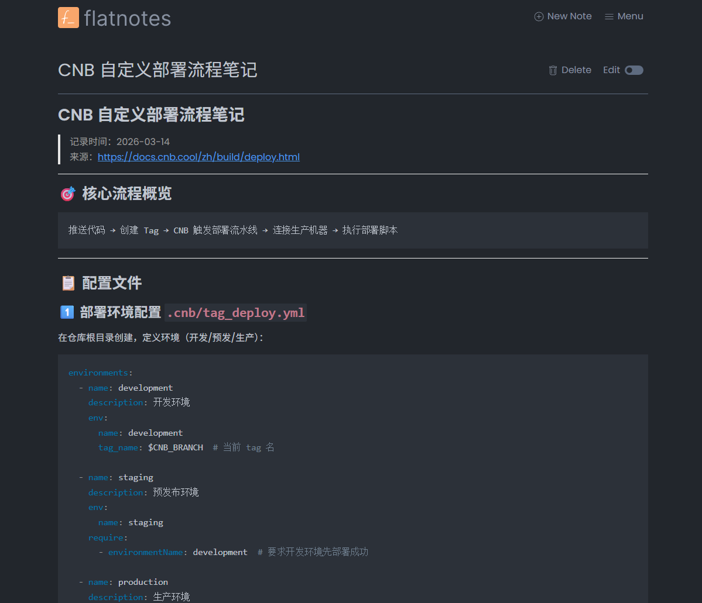
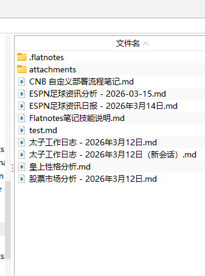

## 写在前面



最近的龙虾热不必多说，我是通过云服务器+qqbot插件接入的OpenClaw，用了一段时间，开始试着让龙虾分析开源项目/股票行情，但虽然qq支持markdown渲染，但较长的文本会被拆成几节，读起来也很费劲，于是想着让龙虾将文本写在云文档（如飞书）中交给我。

这虽然解决了一部分问题，但我逐渐发现不少云文档软件**并没有将编辑接口或MCP免费开放给用户**，笔记也是**托管在厂商的服务器中**，无法自己管理，希望将一切掌握在自己手里的我就坐不住了。

## 适合你么
1. **Agent可编辑**：需要找到合适的适合Agent编辑的笔记管理手段
2. **文件式管理笔记**: 以.md文件为单位管理文本，而不是数据库存储等，便于Git备份
3. **全面支持Web阅读与编辑**: 无需下载软件，浏览器就是阅读和编辑的环境
4. **图片托管能力**: 省得你自建或找图床

## Flatnotes

> 开源笔记工具: [Flatnotes](https://github.com/dullage/flatnotes)

Flatnotes是一款开源笔记工具，秉持极简化轻量化的理念，用最简单的方式管理md文档（甚至有点简陋），摒弃了权限管理/文件夹管理等功能，提供了完整的Restful API，且自带图片托管能力，给了我们最纯粹的功能。

### 最简化部署

> （当然可以求虾哥帮帮你）

```bash
docker run -d \
  -e "PUID=1000" \
  -e "PGID=1000" \
  -e "FLATNOTES_AUTH_TYPE=password" \
  -e "FLATNOTES_USERNAME=user" \    # 账号
  -e 'FLATNOTES_PASSWORD=changeMe!' \ # 密码
  -e "FLATNOTES_SECRET_KEY=aLongRandomSeriesOfCharacters" \
  -v "$(pwd)/data:/data" \ # 资源挂载路径/容器内路径
  -p "8080:8080" \  # 端口
  dullage/flatnotes:latest
```

## 虾怎么办

我们知道FlatNotes提供了完整的Restful API接口，在完成部署以后，只需要将API文档发给自己的龙虾，沉淀为一个技能，就可以实现无缝对接， **其他提供Restful API接口的开源项目也可以这么做** 。



**如果你的龙虾比较笨（或者你比较懒），也可以尝试直接使用我的skill，让龙虾替你修改一下环境变量就能用**

> [Flatnotes Skill 仓库地址](https://cnb.cool/iceicc-ai-made/skills/-/tree/main/flatnotes-service)
>
> 安装到龙虾的Skill文件夹（默认为 `~/.openclaw/skills/`）
>
> （当然也可以发给虾哥帮你）

## 效果
结合Skill和Flatnotes项目，你就可以得到可以随时输出漂亮的Markdown文本，并能够轻松自由沉淀下来的助手



点击龙虾发回给你的链接，输入设置过的账号密码，即可自由浏览/编辑你的笔记：



可以看到它UI简洁，阅读体验也很不错，点击右上角即可直接编辑

登录到部署文件夹，可以看到.md文档整整齐齐摆在那里，任你摆布

